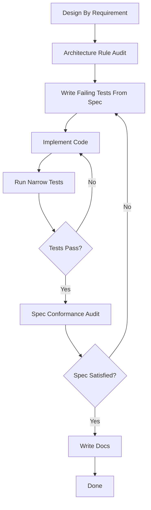

# Agent Workflow

이 문서는 `Remittance` 레포에서 agent mode를 사용할 때 권장하는 공식 실행 흐름을 정의한다.
이 흐름은 현재 `.codex/agents/*.toml` 역할 정의를 기준으로 한다.

## Official Flow

## Agent Mapping

### 1. Design By Requirement

- `requirement-extractor`
- `domain-spec-designer`
- `application-flow-designer`

실행 규칙:

- 먼저 `requirement-extractor`로 요구사항을 고정한다.
- 그 다음 `domain-spec-designer`와 `application-flow-designer`는 같은 레벨에서 병렬 실행 가능하다.
- 둘 다 read-only 단계다.

### 2. Architecture Rule Audit

- `architecture-rule-auditor`

실행 규칙:

- 설계 결과가 현재 멀티모듈 구조, 의존 규칙, `api-internal`, `BeanRegistrarDsl` 규율에 맞는지 게이트로 검사한다.
- 여기서 blocked 판정이 나면 구현 단계로 내려가지 않는다.
- blocked면 design 단계로 되돌아간다.

### 3. Write Failing Tests From Spec + Implement Code

- `implementer`

실행 규칙:

- 구현 단계의 첫 동작은 승인된 spec에서 가장 작은 failing test를 뽑아 작성하거나 수정하는 것이다.
- 그 다음 최소 프로덕션 코드를 작성한다.
- 가장 좁은 관련 Gradle 검증을 실행한다.
- 테스트가 실패하면 같은 단계 안에서 구현과 좁은 검증을 반복한다.

즉, 내부 루프는 아래와 같다.

1. failing test 준비
2. 구현
3. 좁은 테스트 실행
4. 실패 시 구현 단계 반복

### 4. Spec Conformance Audit

- `spec-conformance-auditor`

실행 규칙:

- 테스트가 통과했다고 바로 완료하지 않는다.
- 구현 결과가 승인된 spec을 실제로 만족하는지 다시 검사한다.
- `Partially Satisfied` 또는 `Not Satisfied`가 있으면 implement 단계로 되돌아간다.
- 되돌아갈 때는 unmet criterion 기준으로 다시 failing test를 보강하고 구현을 반복한다.

### 5. Write Docs

- `docs-sync-writer`

실행 규칙:

- 모든 acceptance criterion이 `Satisfied`일 때만 실행한다.
- 코드보다 늦게 실행한다.
- 계약, 흐름, 구조 변경이 있으면 관련 문서를 동기화한다.
- 문서 영향이 없으면 no-op 보고만 하고 끝낸다.

## Parallelism

현재 설정 기준:

- `max_threads = 6`
- `max_depth = 1`

실질적으로 병렬 가능한 구간은 다음뿐이다.

- `domain-spec-designer`
- `application-flow-designer`

나머지 단계는 게이트 성격이 강하므로 직렬 실행이 기본이다.

## Failure Control

이 흐름의 실패 제어는 두 겹이다.

1. 테스트 실패 루프
    - `implementer` 안에서 해결
2. spec 불충족 루프
    - `spec-conformance-auditor` 결과를 기준으로 다시 구현 단계로 복귀

즉, 구현 완료 조건은 두 가지를 모두 만족해야 한다.

- 좁은 테스트 통과
- spec conformance fully satisfied

이 둘 중 하나라도 만족하지 못하면 docs 단계로 넘어가지 않는다.
