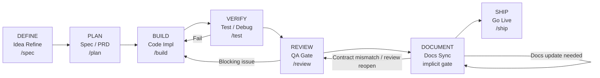

# Agent Workflow

이 문서는 `Remittance` 레포에서 팀이 따를 공식 agent workflow를 정의한다.
팀 표준 커맨드는 6개지만, `SHIP` 전에 `DOCUMENT` 게이트가 필수다.

`DEFINE -> PLAN -> BUILD -> VERIFY -> REVIEW -> DOCUMENT -> SHIP`

## Canonical Flow

## Stage Contract

| Stage    | Team Command           | Primary Outcome                            | Exit Criteria                                                                      | Default Surface                                                     |
|----------|------------------------|--------------------------------------------|------------------------------------------------------------------------------------|---------------------------------------------------------------------|
| DEFINE   | `/spec`                | 문제 정의, 범위, acceptance 기준, open question 정리 | acceptance criteria / 비목표 / open question이 정리되어 PLAN 입력으로 넘길 수 있음                  | explicit skill: `spec`                                              |
| PLAN     | `/plan`                | PRD / test-spec / 구현 순서 확정                 | 구현 순서, 검증 전략, 리스크가 고정되고 필요 시 `.omx/plans/prd-*.md`, `.omx/plans/test-spec-*.md` 생성 | explicit skill: `plan`, 필요 시 `ralplan`, design agents               |
| BUILD    | `/build`               | 승인된 범위의 최소 구현                              | 승인된 범위의 최소 구현 완료 + 좁은 failing test가 해소됨                                            | explicit skill: `build`, `implementer`, `executor`                  |
| VERIFY   | `/test`                | 좁은 테스트 통과, 디버깅 완료, 증거 수집                   | 관련 테스트 green + 실패 원인 설명 가능 + 핵심 증거 수집 완료                                           | explicit skill: `test`, `debugger`, `verifier`                      |
| REVIEW   | `/review`              | QA gate, spec 적합성, 위험 점검                   | blocking issue 없음, non-blocking issue는 명시적 기록 완료                                   | explicit skill: `review`, `code-review`, `spec-conformance-auditor` |
| DOCUMENT | implicit pre-ship gate | 변경된 계약/흐름/구조 문서 동기화                        | 영향 문서 확인 완료 + 필요 문서 수정 또는 no-op 근거 기록 완료                                           | explicit skill: `docs-sync-writer`, 필요 시 `writer`                   |
| SHIP     | `/ship`                | 릴리즈 readiness, 배포 또는 go-live handoff       | VERIFY green + REVIEW pass + DOCUMENT complete + 최종 보고 준비 완료                       | explicit skill: `ship`                                              |

## Agent Mapping

### 1. DEFINE

- `requirement-extractor`
- 필요 시 `deep-interview`

실행 규칙:

- 아이디어를 바로 코드로 옮기지 않는다.
- 먼저 문제, 목표, 비목표, 제약, acceptance criteria를 고정한다.
- 미해결 질문은 이 단계에서 드러내고, PLAN 단계로 넘길 입력을 만든다.
- 산출물은 PRD 초안 또는 그에 준하는 요구사항 정리다.

### 2. PLAN

- `planner`
- `domain-spec-designer`
- `application-flow-designer`
- `architecture-rule-auditor`

실행 규칙:

- DEFINE에서 고정한 요구를 구현 가능한 PRD / task sequence로 바꾼다.
- `domain-spec-designer`와 `application-flow-designer`는 병렬 가능하다.
- 설계 결과는 반드시 `architecture-rule-auditor` 게이트를 통과해야 한다.
- `ralph`를 사용할 경우 이 단계 완료 기준은 `.omx/plans/prd-*.md` 와 `.omx/plans/test-spec-*.md` 생성이다.

### 3. BUILD

- `implementer`
- `executor`

실행 규칙:

- BUILD는 승인된 PRD / plan 이후에만 시작한다.
- 첫 동작은 가장 작은 failing test를 선택하거나 보강하는 것이다.
- 그 다음 최소 프로덕션 코드만 수정한다.
- 구현 중 불필요한 구조 변경이나 plan 밖 리팩터링은 금지한다.

내부 루프:

1. failing test 선택 또는 보강
2. 최소 구현
3. 좁은 검증 실행
4. 실패 시 같은 단계 반복

### 4. VERIFY

- `test`
- `debugger`
- `verifier`

실행 규칙:

- VERIFY는 단순 테스트 실행이 아니라 테스트 + 디버깅 + 증거 수집 단계다.
- 가장 좁은 Gradle 태스크부터 실행한다.
- 실패 원인을 분석하고 BUILD로 되돌릴지, VERIFY 안에서 해결할지 판단한다.
- 완료 기준은 "테스트 green"과 "왜 green인지 설명 가능한 증거" 둘 다다.

### 5. REVIEW

- `review`
- `code-reviewer`
- `spec-conformance-auditor`
- 필요 시 `security-reviewer`, `architecture-rule-auditor`

실행 규칙:

- REVIEW는 QA gate다.
- findings-first 원칙을 따른다.
- 테스트가 통과해도 spec 불충족, 경계 위반, 문서 누락이 있으면 통과시킬 수 없다.
- **blocking issue**: spec 불충족, 구조/경계 위반, 보안 문제, 문서 계약 누락. 발견 시 BUILD로 되돌아간다.
- **non-blocking issue**: naming, 표현, 후속 정리 권고. 구현을 막지는 않지만 최종 보고에 남긴다.

### 6. DOCUMENT

- `docs-sync-writer`
- 필요 시 `writer`

실행 규칙:

- DOCUMENT는 SHIP 직전의 필수 게이트다.
- 계약, 흐름, 구조, 운영 절차가 바뀌었으면 반드시 문서를 동기화한다.
- 문서 영향이 없으면 no-op 근거를 남긴다.
- 문서화가 끝나기 전에는 SHIP으로 넘기지 않는다.
- 최소 확인 문서:
  - `docs/filter_arch.md`
  - `docs/rule/dependencies.md`
  - 관련 `docs/api/*.md`
  - 관련 `docs/flow/*.md`
- 위 문서 중 실제 영향이 있는 것만 수정하되, 무엇을 확인했고 왜 no-op인지도 남긴다.

### 7. SHIP

- `ship`

실행 규칙:

- SHIP은 "배포 준비 완료" 또는 "go-live handoff 완료" 단계다.
- 기본값은 readiness gate이며, 실제 배포/릴리즈 명령은 사용자 요청 또는 승인된 운영 절차가 있을 때만 실행한다.
- 최종 보고에는 검증 근거, 남은 리스크, 미실행 항목을 명시한다.

## Failure Control

실패 제어는 세 겹이다.

1. VERIFY 실패 루프
   - 테스트 실패, 런타임 오류, wiring 오류는 BUILD <-> VERIFY 사이에서 해결한다.
2. REVIEW 실패 루프
   - blocking issue(spec 미충족, QA finding, 구조 위반)는 REVIEW 결과를 기준으로 BUILD로 되돌아간다.
   - non-blocking issue는 기록 후 DOCUMENT/SHIP으로 넘길 수 있다.
3. DOCUMENT 실패 루프
   - 문서 누락, 설명 불일치, 운영 handoff 부족은 먼저 DOCUMENT에서 수정한다.
   - 문서가 구현/검토 결과와 충돌하면 REVIEW로 되돌아간다.

즉, SHIP 전 조건은 다음 셋을 모두 만족하는 것이다.

- VERIFY green
- REVIEW gate pass
- DOCUMENT complete

## Parallelism

현재 설정 기준:

- `max_threads = 6`
- `max_depth = 1`

병렬성이 가장 큰 구간은 PLAN이다.

- `domain-spec-designer`
- `application-flow-designer`

BUILD 이후 단계는 게이트 성격이 강하므로 직렬 실행이 기본이다.

## Team Command Notes

이 워크플로의 `/spec`, `/plan`, `/build`, `/test`, `/review`, `/ship`은 팀 표준 vocabulary다.
`DOCUMENT`는 현재 별도 slash command 없이 `REVIEW` 이후, `SHIP` 이전에 반드시 수행하는 implicit gate다.
Codex 내부에서는 skill / agent / keyword routing으로 해석된다.
