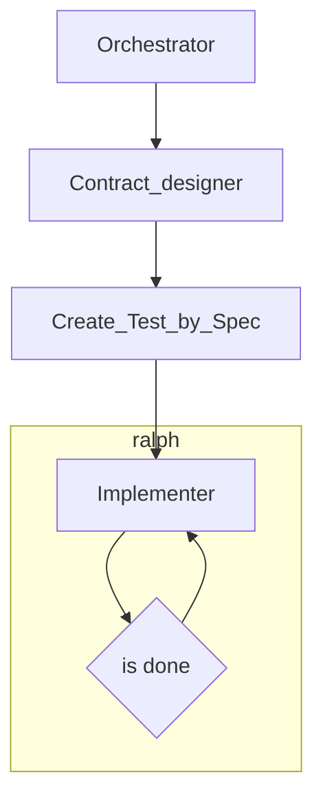

- test framework 개선
    - integrationTest 규칙적이지 않음
- SDD/TDD harness 구축
  - Orchestrator: 요구사항을 받아서 작업 배분을 한다.
  - Contract_designer: 모듈, 코드상의 계약을 스펙에 맞게 먼저 만든다.
  - Create_Test_by_Spec: 스펙에 맞게 먼저 통합 테스트를 작성한다. 가능한 발생 가능한 모든 상황에 대해 통합 테스트가 작성된다.
  - Implementer: 계약 구현자들을 만든다. 계약 갯수만큼의 구현자들이 생겅된다. 각 구현자들은 계약이 요구사항을 충족할 수 있도록 구현한다. 구현이 테스트코드를 통과하기 전까지 계속해서 반복한다.
  - Auditor: 요구사항, 의존 관계, 코드 스타일 순으로 규칙을 준수했는지 검수한다. 검수가 실패하면 실패한 지점의 담당자를 호출한다.
  - Documenter: 작업이 모두 완료됐다면 STAR 기법을 준수하여 문서를 md 형식으로 작성한다. 이 문서는 다음 에이전트 세션의 지식 기반이 된다. 

- trust base code policy
  - rollback시 이전 코드를 신뢰한다
  - git rollback 권장
  - 옳다고 볼 수 있는가?
- application간 호출 구조
  - 계약을 하나의 모듈에서 관리 어떻게 생각?
