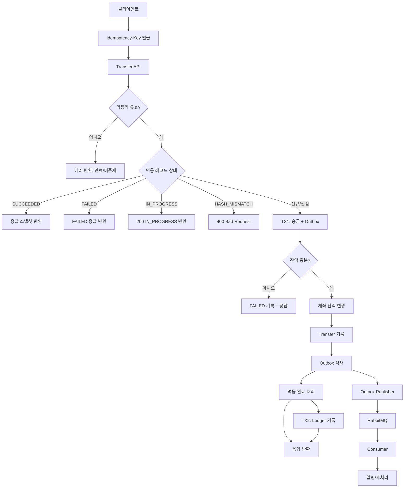

# 계좌 이체 흐름

계좌 이체는 멱등 처리 + outbox 패턴을 사용해
동일 요청의 재실행을 제어하고, 이체 성공 시 outbox 이벤트를 남긴다.


```mermaid
flowchart TD
    client[클라이언트]
    idem[Idempotency-Key 발급]
    api[Transfer API]
    keyValidate{멱등키 유효?}
    keyInvalid[에러 반환: 만료/미존재]
    idemStore{멱등 레코드 상태}
    idemSuccess[응답 스냅샷 반환]
    idemFailed[FAILED 응답 반환]
    idemProgress[200 IN_PROGRESS 반환]
    idemConflict[400 Bad Request]
    tx1[TX1: 송금 + Outbox]
    balanceCheck{잔액 충분?}
    tx1Failed[FAILED 기록 + 응답]
    accounts[계좌 잔액 변경]
    transfer[Transfer 기록]
    outbox[Outbox 적재]
    idemComplete[멱등 완료 처리]
    response[응답 반환]
    tx2[TX2: Ledger 기록]
    publisher[Outbox Publisher]
    mq[RabbitMQ]
    consumer[Consumer]
    notify[알림/후처리]
    client --> idem --> api --> keyValidate
    keyValidate -- 아니오 --> keyInvalid
    keyValidate -- 예 --> idemStore
    idemStore -- SUCCEEDED --> idemSuccess
    idemStore -- FAILED --> idemFailed
    idemStore -- IN_PROGRESS --> idemProgress
    idemStore -- HASH_MISMATCH --> idemConflict
    idemStore -- 신규/선점 --> tx1
    tx1 --> balanceCheck
    balanceCheck -- 아니오 --> tx1Failed
    balanceCheck -- 예 --> accounts --> transfer --> outbox --> idemComplete --> response
    idemComplete --> tx2 --> response
    outbox --> publisher --> mq --> consumer --> notify
```

---

## 0. 데이터 모델 전제

도메인 데이터는 `core` 스키마에 두고, 멱등/이벤트 데이터는 `integration` 스키마로 분리한다.

- `core`: `account`, `transfer` 등 도메인 테이블
- `integration`: `idempotency_key`, `outbox_events`, `processed_events`

### `integration.idempotency_key`

- `(client_id, scope, idempotency_key)` UNIQUE
- `status`: `BEFORE_START | IN_PROGRESS | SUCCEEDED | FAILED | TIMEOUT`
- `request_hash`
- `response_snapshot` (transferId, status, error_code)
- `started_at`, `completed_at`

#### request_hash 규칙

- canonical JSON
- `{"fromAccountId":<long>,"toAccountId":<long>,"amount":<decimal>}`
- `amount`는 JSON number로 직렬화
- `SHA-256` 해시

---

### `integration.outbox_events`

- `event_id` (BIGINT, PK)
- `aggregate_type`: `TRANSFER`
- `aggregate_id`: transferId
- `event_type`: `TRANSFER_COMPLETED`
- `payload`
- `status`: `NEW | SENT`
- `created_at`

---

## 1. 클라이언트 요청

- 먼저 `POST /idempotency-keys`로 멱등키를 발급받는다.
- 현재 aggregate 기본 설정에서 멱등키 만료 시간은 `24h`다.
- 실제 이체 요청은 `POST /transfers/{idempotencyKey}` 로 보낸다.
- 동일 요청 재시도 시 같은 키를 사용한다.

```json
{
  "fromAccountId": 1,
  "toAccountId": 2,
  "amount": 10000
}
```

---

## 2. 서버 요청 수신

1. `Idempotency-Key` 존재 및 만료 여부 검증
2. `(client_id, scope, idempotency_key)` 기준으로 멱등 처리 시작

---

## 3. 멱등 처리

현재 구현은 아래 순서로 동작한다.

1. 키를 조회한다.
    - 없으면 `404 Not Found`
    - 만료되었으면 `400 Bad Request`
2. 요청 바디 해시를 계산한다.
3. 기존 상태를 확인한다.
    - `SUCCEEDED` 또는 `FAILED` 이면 저장된 스냅샷을 그대로 반환
    - `IN_PROGRESS` 이면 `200 OK` + `{"status":"IN_PROGRESS"}` 반환
4. 같은 키에 다른 요청 바디가 오면 `400 Bad Request`
5. 신규 또는 `BEFORE_START` 상태면 `IN_PROGRESS`로 선점하고 처리로 진입한다.

---

## 4. 송금 처리

### 4-1. TX1 (Transfer + Outbox)

1. 계좌 잠금

    - `min(accountId) → max(accountId)` 순서로 row lock
2. 잔액 검증

    - 부족 시 `FAILED`, `error_code = INSUFFICIENT_BALANCE`
3. 잔액 변경

    - from 감소 / to 증가
4. Transfer 기록

    - transferId 생성
    - transfer insert
    - `transferId UNIQUE` (최종 중복 방어)
5. outbox 적재

    - `TRANSFER_COMPLETED`, `status = NEW`
    - 현재 구현에서 outbox는 `TRANSFER` scope일 때만 생성
6. 멱등 레코드 완료 처리

    - `status = SUCCEEDED`
    - `response_snapshot` 저장
7. TX1 커밋

    - 도중 `TransferFailedException` 발생 시 `FAILED` 스냅샷 저장 후 `200 OK` 응답 body로 반환
    - 예상하지 못한 예외 발생 시 전체 롤백되고 멱등 상태는 `IN_PROGRESS`로 남을 수 있음

### 4-2. TX2 (Ledger)

1. TX1 커밋 이후 별도 트랜잭션(`REQUIRES_NEW`) 시작
2. Ledger 기록

    - `(transfer_id, account_id, side)` UNIQUE
3. TX2 커밋

    - 실패 시 예외를 다시 던진다
    - 호출 시점에 TX1은 이미 커밋된 뒤이므로, 요청은 `500`이지만 transfer/outbox/idempotency는 이미 성공 상태다

---

## 5. 응답 반환

- `200 OK`

```json
{
  "transferId": "...",
  "status": "SUCCEEDED"
}
```

- 비즈니스 실패도 현재 구현에서는 HTTP 200 + body `status=FAILED` 로 반환된다.
- 응답 전 서버 크래시가 발생하면 멱등 상태에 따라 다음 재요청에서 `SUCCEEDED`, `FAILED`, `IN_PROGRESS` 중 하나가 반환될 수 있다.

---

## 6. TIMEOUT 상태에 대한 현재 구현 메모

- repository 계층은 오래된 `IN_PROGRESS`를 `TIMEOUT`으로 바꾸는 기능을 지원한다.
- 하지만 현재 aggregate 애플리케이션에는 이를 주기적으로 실행하는 watchdog 스케줄러가 연결되어 있지 않다.
- 따라서 현재 문서 기준의 실행 경로에서는 `IN_PROGRESS` 정리 배치를 전제하지 않는다.

---

## 7. outbox publisher

- publish 성공 → `SENT`
- 실패 → 상태 유지, 다음 스케줄 주기에 다시 시도
- 중복 발행 가능(정상)

---

## 8. 현재 구현에서 주의할 HTTP 동작

- `INSUFFICIENT_BALANCE`, `DAILY_LIMIT_EXCEEDED`, `ACCOUNT_NOT_FOUND` 같은 도메인 실패는 주로 `200 OK` +
  `status=FAILED`로 반환된다.
- 요청 body 검증 실패, 멱등키 만료, 멱등키 body conflict는 `400 Bad Request`다.
- 멱등키 미존재는 `404 Not Found`다.

추가 후처리와 소비 흐름은 [transfer-notification.md](transfer-notification.md)를 따른다.
