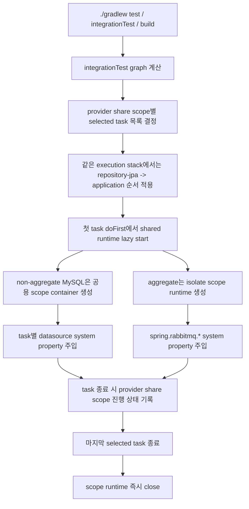

# Gradle 빌드 성능 문서

## 1. 목적

이 문서는 현재 레포의 Gradle 통합 테스트가 어떤 단위로 병렬화되고, Testcontainers를 어떤 생명주기로 공유하는지 설명한다.

- `integrationTest`는 `test`와 분리되어 있다.
- `check`, `build`는 여전히 `integrationTest`를 포함하지만, CI에서는 `test`와 `integrationTest`를 별도 단계로 실행한다.
- 도메인 간 task는 병렬로 실행한다.
- 같은 도메인 안의 `integrationTest`는 `repository-jpa -> application` 순서로 직렬 실행한다.
- ordering과 mutual exclusion lock은 도메인 execution stack 단위로 유지한다.
- 컨테이너 공유는 provider share scope 단위로 계산한다.
- 해당 provider share scope의 마지막 selected `integrationTest`가 끝나면 runtime을 즉시 정리한다.

## 2. 현재 적용 대상

루트 [[build.gradle.kts]] 는 `src/integrationTest`가 있는 모듈에만 `integrationTest` 스위트를
생성한다.

- `test` task는 단위/모듈 테스트 경로로 유지한다.
- `integrationTest` task를 직접 호출하면 `aggregate`를 포함한 전체 통합 검증 경로를 독립적으로 실행할 수 있다.

현재 대상:

- `account:repository-jpa`
- `account:application`
- `member:repository-jpa`
- `member:application`
- `transfer:repository-jpa`
- `transfer:application`
- `aggregate`

## 3. execution stack 규칙

각 모듈은 자기 `integrationTest`의 execution stack을 명시한다.

- `account`
    - `account:repository-jpa:integrationTest` -> `use("mysql")`
    - `account:application:integrationTest` -> `use("mysql")`
- `member`
    - `member:repository-jpa:integrationTest` -> `use("mysql")`
    - `member:application:integrationTest` -> `use("mysql")`
- `transfer`
    - `transfer:repository-jpa:integrationTest` -> `use("mysql")`
    - `transfer:application:integrationTest` -> `use("mysql")`, `use("rabbitmq")`
- `aggregate`
    - `aggregate:integrationTest` -> `use("mysql")`, `use("rabbitmq")`, `isolate("mysql")`, `isolate("rabbitmq")`

stack key는 도메인명과 동일하다.

예:

```kotlin
testcontainers {
    bom("org.testcontainers:testcontainers-bom:${libs.versions.testcontainers.get()}")
    task("integrationTest") {
        stack("member")
        use("mysql")
    }
}
```

## 4. 컨테이너 공유 방식

### 4.1 MySQL

MySQL은 task별 `jdbc:tc:` 컨테이너를 직접 띄우지 않고, provider share scope 기준 shared container를 사용한다.

-
provider: [[build-logic/src/main/kotlin/org/yechan/remittance/buildlogic/MySqlSharedContainerProvider.kt]]
-
registry: [[build-logic/src/main/kotlin/org/yechan/remittance/buildlogic/SharedContainerContracts.kt]]

다만 DB state는 task 간에 공유하지 않는다.

- non-aggregate 경로는 `mysql:non-aggregate` share scope를 공용으로 사용한다.
- `aggregate:integrationTest`는 `isolate("mysql")`로 별도 scope를 사용한다.
- 데이터베이스는 task path 기준으로 분리

예:

- `member_repository_jpa_integrationtest`
- `member_application_integrationtest`

테스트 task에는 다음 system property를 주입한다.

- `spring.datasource.url`
- `spring.datasource.username`
- `spring.datasource.password`
- `spring.datasource.driver-class-name`

기존 `application.yml`의 `jdbc:tc:mysql:...` 값은 fallback으로 남아 있다. shared scope 경로에서는 Gradle이 주입한 system
property가 우선 적용된다.

### 4.1.1 Liquibase 사전 적용

Liquibase를 사용하는 `integrationTest`는 BuildService 준비 단계에서 changelog를 먼저 적용할 수 있다.

- task는 `testcontainers { task("integrationTest") { liquibase("classpath:/...") } }`로 changelog를 선언한다.
- Gradle은 shared datasource system property를 먼저 주입한 뒤, 테스트 classpath를 사용해 Liquibase migration을 수행한다.
- 이후 테스트 JVM에는 `spring.liquibase.enabled=false`를 주입해 Spring Boot가 같은 migration을 다시 수행하지 않게 한다.

현재 적용 대상:

- `account:repository-jpa:integrationTest`
- `account:application:integrationTest`
- `member:repository-jpa:integrationTest`
- `member:application:integrationTest`
- `transfer:repository-jpa:integrationTest`
- `transfer:application:integrationTest`
- `aggregate:integrationTest`

### 4.2 RabbitMQ

RabbitMQ는 현재 execution stack 기본 scope를 유지한다.

-
provider: [[build-logic/src/main/kotlin/org/yechan/remittance/buildlogic/RabbitMqSharedContainerProvider.kt]]
- `transfer:application:integrationTest`는 execution stack `transfer` scope를 사용한다.
- `aggregate:integrationTest`는 `isolate("rabbitmq")`로 별도 scope를 사용한다.

RabbitMQ는 queue/exchange/routing key namespace가 전역 고정값이라 cross-stack 공유를 넓히지 않는다.

## 5. 실행 순서

도메인 내부 ordering은 build logic가 중앙에서 구성한다.

- 같은 stack에 `repository-jpa:integrationTest`와 `application:integrationTest`가 모두 있으면
- `application:integrationTest.mustRunAfter(repository-jpa:integrationTest)`를 적용한다.
- `dependsOn`은 사용하지 않는다.

즉, 단독 실행은 그대로 가능하다.

- `:member:application:integrationTest`만 실행 가능
- `:member:repository-jpa:integrationTest`만 실행 가능

하지만 둘 다 graph에 들어오면 순서는 항상 아래와 같다.

```text
member:repository-jpa:integrationTest
member:application:integrationTest
```

## 6. lifecycle

shared runtime의 생명주기는 build 전체가 아니라 provider share scope 기준으로 관리한다.

- execution stack은 ordering과 lock에만 사용한다.
- 실행 graph가 준비되면 `(providerKey, providerShareScopeKey)` 별 selected `integrationTest` task 목록을 계산한다.
- scope의 첫 task가 시작될 때 필요한 provider runtime을 lazy start 한다.
- 각 task가 끝날 때 provider share scope 진행 상태를 기록한다.
- 마지막 selected task가 끝나면 해당 provider runtime을 즉시 close 한다.
- `buildFinished` close는 비정상 종료 시 안전망으로만 남긴다.

관련 구현:

- [[build-logic/src/main/kotlin/org/yechan/remittance/buildlogic/TestcontainersPlugin.kt]]
- [[build-logic/src/main/kotlin/org/yechan/remittance/buildlogic/TaskContainerBinder.kt]]
- [[build-logic/src/main/kotlin/org/yechan/remittance/buildlogic/SharedContainerService.kt]]

## 7. 실행 흐름



## 8. 트레이드오프

### 장점

- 도메인 간 병렬성은 유지한다.
- non-aggregate MySQL은 도메인 간에도 컨테이너 기동 비용을 한 번만 지불한다.
- task별 DB 분리로 `repository-jpa`와 `application` 사이의 상태 오염을 막는다.
- `aggregate`는 명시적으로 isolate되어 non-aggregate와 컨텍스트를 섞지 않는다.
- `aggregate`를 포함한 전체 통합 검증 경로를 `integrationTest` 단계로 명시 실행할 수 있다.
- Liquibase가 BuildService 준비 단계에서 먼저 적용되므로 Spring Boot startup에서 반복 migration 비용을 줄일 수 있다.

### 한계

- 현재 ordering 규칙은 `repository-jpa`와 `application` 두 종류의 `integrationTest`만 전제로 한다.
- `buildFinished`와 task graph listener 기반 구현이라 Gradle의 최신 configuration cache 친화적 구조는 아니다.
- RabbitMQ는 exchange/queue/routing key namespace가 전역 고정값이라 cross-stack 공유를 아직 넓히지 못한다.
- `aggregate`는 repository/application ordering 대상이 아니므로, 전체 integration 단계의 wall-clock을 줄이려면 컨텍스트/초기화 비용 최적화가 별도로 필요하다.
- Liquibase 사전 적용 로그는 테스트 stdout이 아니라 task stdout에 먼저 출력된다.

## 9. 검증 명령

권장 명령:

```bash
./gradlew -p build-logic test
JAVA_HOME=$(/usr/libexec/java_home -v 25) ./gradlew --parallel :member:application:integrationTest :account:application:integrationTest --rerun-tasks
JAVA_HOME=$(/usr/libexec/java_home -v 25) ./gradlew --parallel :transfer:application:integrationTest :aggregate:integrationTest --rerun-tasks
JAVA_HOME=$(/usr/libexec/java_home -v 25) ./gradlew build --rerun-tasks --info
```

참고:

- 현재 기본 `java`가 JDK 26이면 Gradle script parsing 단계에서 `Unsupported class file major version 70`가 발생할 수
  있다.
- 로컬 검증은 JDK 24 또는 25로 `JAVA_HOME`을 내려 실행하는 것이 안전하다.
