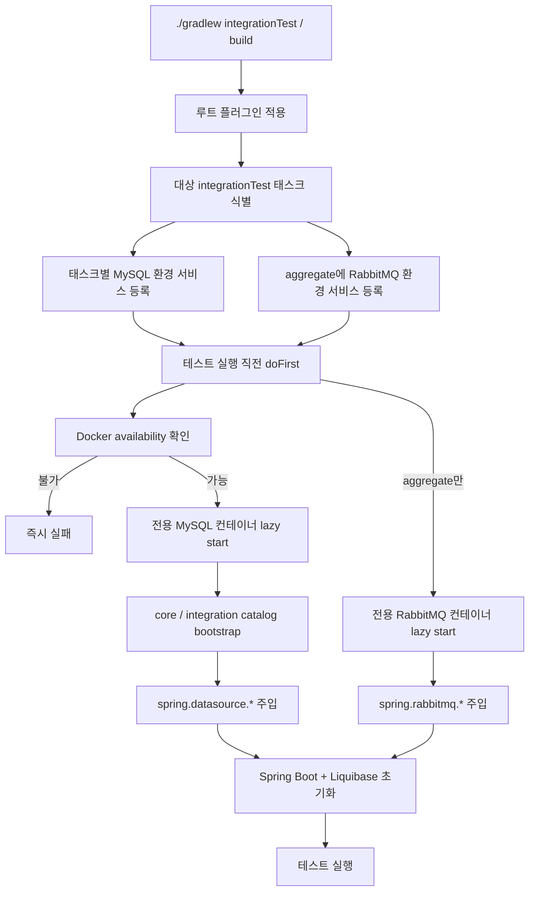

# Gradle Build 성능: 병렬 integrationTest 환경

## 1. 목표

`integrationTest`의 wall-clock time을 줄이면서도 `build`, `check`에 포함되는 통합 테스트 검증을 유지한다.

- 통합 테스트는 계속 `check`에 포함된다.
- 주요 integration test 태스크는 병렬 실행이 가능해야 한다.
- 테스트 간 DB/브로커 상태를 공유하지 않는다.
- Docker가 없는 환경에서는 테스트를 건너뛰지 않고 즉시 실패한다.

현재 병렬 실행 대상으로 보는 태스크는 다음 네 가지다.

- `:account:repository-jpa:integrationTest`
- `:member:repository-jpa:integrationTest`
- `:transfer:repository-jpa:integrationTest`
- `:aggregate:integrationTest`

## 2. 변경 요약

이전의 build-wide 공유 컨테이너와 DB reset 방식 대신, 각 주요 integration test 태스크가 자기 전용 Testcontainers 환경을 사용한다.

- 각 repository-jpa integration test는 전용 MySQL 컨테이너를 사용한다.
- `:aggregate:integrationTest`는 전용 MySQL과 전용 RabbitMQ 컨테이너를 사용한다.
- MySQL bootstrap은 fresh 컨테이너에서 `core`, `integration` catalog를 준비한 뒤 Liquibase가 스키마를 적용한다.
- 테스트 태스크 사이에 `mustRunAfter` 체인을 두지 않는다.
- 루트 `gradle.properties`에서 `org.gradle.parallel=true`를 활성화한다.
- Docker가 실행 불가하면 integration test와 이를 포함하는 `build`는 실패해야 한다.

## 3. 구성 요소

### 3.1 루트 빌드

- `build.gradle.kts`
  - 루트에 `remittance.integration-test-environment` 플러그인을 적용한다.
- `gradle.properties`
  - `org.gradle.parallel=true`

### 3.2 build-logic

- `IntegrationTestEnvironmentPlugin`
  - 주요 integration test 태스크만 식별한다.
  - 태스크 path 기준으로 MySQL 환경 build service를 태스크별로 등록한다.
  - `:aggregate:integrationTest`에만 RabbitMQ 환경 build service를 추가 등록한다.
  - 각 테스트 실행 직전에 Docker availability를 확인하고, 미가용 시 즉시 실패한다.
  - 각 컨테이너의 접속 정보를 `spring.datasource.*`, `spring.rabbitmq.*` system property로 주입한다.

- `MySqlIntegrationTestEnvironmentBuildService`
  - 태스크 전용 MySQL 컨테이너를 lazy start한다.
  - fresh 컨테이너에서 `CREATE DATABASE IF NOT EXISTS core`, `CREATE DATABASE IF NOT EXISTS integration`만 수행한다.
  - DB reset이나 shared serialization에는 의존하지 않는다.

- `RabbitMqIntegrationTestEnvironmentBuildService`
  - `:aggregate:integrationTest` 전용 RabbitMQ 컨테이너를 lazy start한다.

## 4. 테스트 코드 연결

테스트 코드는 컨테이너를 직접 띄우지 않고 Spring 설정에만 연결한다.

- repository-jpa integration test 리소스는 Liquibase changelog만 선언한다.
- aggregate integration test는 `IntegrationTestEnvironmentSetup`의 `@DynamicPropertySource`로 Gradle이 주입한 system property를 연결한다.
- `IntegrationTestEnvironmentSystemProperties`는 필수 system property가 없으면 즉시 실패한다.

이 구조에서 repository-jpa 테스트는 RabbitMQ를 요구하지 않고, `aggregate`만 RabbitMQ 연결 정보를 받는다.

## 5. 실행 흐름



## 6. 기대 효과와 트레이드오프

### 기대 효과

- 테스트 간 상태 충돌이 없어 `--parallel` 실행이 가능하다.
- `core`, `integration` catalog 구조와 기존 changelog를 그대로 재사용할 수 있다.
- build-wide DB reset 제거로 flaky interference 가능성이 줄어든다.

### 트레이드오프

- 컨테이너 수는 늘어난다.
- 병렬 실행 시 컨테이너 기동과 Liquibase bootstrap 비용이 추가된다.
- Docker가 필수이므로 로컬/CI 환경 준비가 전제된다.

## 7. 검증 명령

다음 명령으로 단건 실행과 병렬 실행을 검증한다.

```bash
./gradlew :account:repository-jpa:integrationTest --rerun-tasks
./gradlew :member:repository-jpa:integrationTest --rerun-tasks
./gradlew :transfer:repository-jpa:integrationTest --rerun-tasks
./gradlew :aggregate:integrationTest --rerun-tasks
./gradlew --parallel integrationTest --rerun-tasks --profile
./gradlew --parallel build --rerun-tasks --profile
```

profile 결과물은 `build/reports/profile/` 아래에서 확인할 수 있다.
