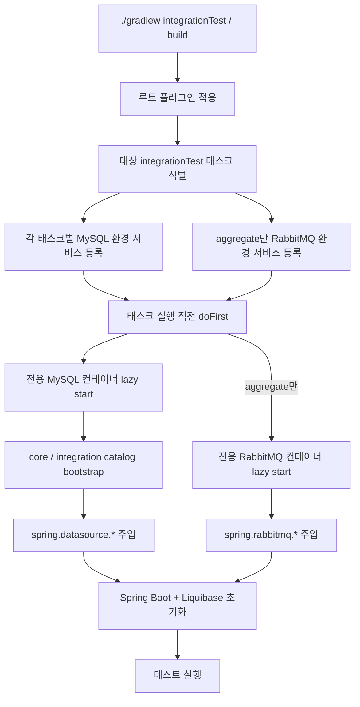

# Gradle Build 성능: 병렬 integrationTest 환경

## 1. 목표

현재 구조의 목표는 `integrationTest` wall-clock time을 줄이면서 `build`, `check`의 의미를 유지하는 것이다.

- 통합 테스트는 계속 `check`에 포함된다.
- 네 개 주요 통합 테스트 태스크는 병렬 실행 가능해야 한다.
- 테스트 간 외부 시스템 상태는 공유하지 않는다.

대상 태스크는 다음 네 개다.

- `:account:repository-jpa:integrationTest`
- `:member:repository-jpa:integrationTest`
- `:transfer:repository-jpa:integrationTest`
- `:aggregate:integrationTest`

## 2. 변경된 전략

이전의 빌드 전역 공유 컨테이너 + DB reset 전략은 제거했다. 지금은 각 태스크가 자기 전용 외부 시스템 환경을 가진다.

- 각 대상 `integrationTest` 태스크는 자기 전용 MySQL 컨테이너를 사용한다.
- `:aggregate:integrationTest`만 자기 전용 RabbitMQ 컨테이너를 추가로 사용한다.
- MySQL bootstrap은 fresh 컨테이너에서 `core`, `integration` catalog를 준비한 뒤 Liquibase가 스키마를 올린다.
- 태스크 간 `mustRunAfter` 체인은 없다.
- 루트 `gradle.properties`에서 `org.gradle.parallel=true`를 활성화했다.

즉, 병렬성은 Gradle task graph와 태스크 격리된 Testcontainers 환경으로 확보하고, 스키마 초기화는 기존 Liquibase changelog 계약에 그대로 맡긴다.

## 3. 구성 요소

### 3.1 루트 빌드

- `build.gradle.kts`
  - 루트에 `remittance.integration-test-environment` 플러그인을 적용한다.
- `gradle.properties`
  - `org.gradle.parallel=true`

### 3.2 build-logic

- `IntegrationTestEnvironmentPlugin`
  - 네 개 대상 태스크만 식별한다.
  - 각 태스크 path 기준으로 MySQL 환경 서비스를 개별 등록한다.
  - aggregate 태스크에만 RabbitMQ 환경 서비스를 개별 등록한다.
  - 실행 직전에 `spring.datasource.*`, `spring.rabbitmq.*` system property를 주입한다.

- `MySqlIntegrationTestEnvironmentBuildService`
  - 태스크 전용 MySQL 컨테이너를 lazy start한다.
  - fresh 컨테이너에서 `CREATE DATABASE IF NOT EXISTS core`, `CREATE DATABASE IF NOT EXISTS integration`만 수행한다.
  - DB reset이나 shared serialization에 의존하지 않는다.

- `RabbitMqIntegrationTestEnvironmentBuildService`
  - aggregate 태스크용 RabbitMQ 컨테이너를 lazy start한다.

## 4. 테스트 코드 연결

테스트 코드는 여전히 표준 Spring 설정만 본다.

- repository-jpa 통합 테스트 리소스는 Liquibase changelog만 선언한다.
- aggregate 통합 테스트는 `IntegrationTestEnvironmentSetup`의 `@DynamicPropertySource`로 Gradle 주입 속성을 연결한다.
- `IntegrationTestEnvironmentSystemProperties`는 필수 system property가 없으면 즉시 실패한다.

이 구조에서 repository-jpa 테스트는 RabbitMQ를 요구하지 않고, aggregate만 RabbitMQ 연결 정보를 받는다.

## 5. 실행 흐름



## 6. 기대 효과와 트레이드오프

### 기대 효과

- 태스크 간 외부 시스템 충돌이 없어 `--parallel` 실행이 가능하다.
- `core`, `integration` catalog 고정 모델과 기존 changelog를 그대로 유지한다.
- build-wide DB reset 로직이 사라져 flaky interference 원인이 줄어든다.

### 트레이드오프

- 컨테이너 수는 늘어난다.
- 병목이 컨테이너 공유 직렬화에서 Liquibase/bootstrap 비용으로 이동할 수 있다.
- 최적 worker 수는 CI와 로컬 환경에서 별도로 튜닝해야 한다.

## 7. 검증 명령

다음 명령으로 회귀와 병렬성을 검증한다.

```bash
./gradlew :account:repository-jpa:integrationTest --rerun-tasks
./gradlew :member:repository-jpa:integrationTest --rerun-tasks
./gradlew :transfer:repository-jpa:integrationTest --rerun-tasks
./gradlew :aggregate:integrationTest --rerun-tasks
./gradlew --parallel integrationTest --rerun-tasks --profile
./gradlew --parallel build --rerun-tasks --profile
```

profile 산출물은 `build/reports/profile/` 아래에서 확인할 수 있다.
