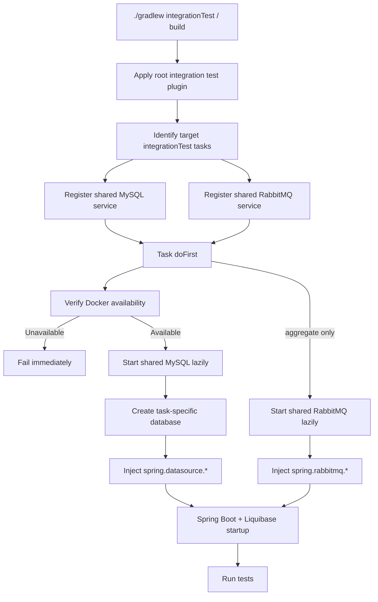

# Gradle Build Performance: Shared Containers for Parallel Integration Tests

## 1. Goal

Reduce `integrationTest` wall-clock time while keeping integration tests inside `build` and `check`.

- Integration tests remain part of `check`.
- Major integration test tasks should run in parallel.
- Docker is required. If Docker is unavailable, integration tests and any `build` that includes them fail immediately.
- Test state must stay isolated even when containers are shared.

The current parallelization target is:

- `:account:repository-jpa:integrationTest`
- `:member:repository-jpa:integrationTest`
- `:transfer:repository-jpa:integrationTest`
- `:aggregate:integrationTest`

## 2. Design Summary

The previous task-scoped container model is replaced with build-wide shared containers.

- One shared MySQL container is created per Gradle invocation.
- One shared RabbitMQ container is created per Gradle invocation.
- MySQL state isolation is handled by creating a dedicated database for each integration test task.
- RabbitMQ currently serves only `:aggregate:integrationTest`, so it uses the default vhost.
- Tasks still receive connection information through Gradle-provided system properties.

This design keeps startup cost near one container boot per build while avoiding DB state sharing between parallel tasks.

## 3. Build Logic

### 3.1 Root Build

- `build.gradle.kts`
  - Applies the root `remittance.integration-test-environment` plugin.
- `gradle.properties`
  - Enables `org.gradle.parallel=true`.

### 3.2 Shared Environment Services

- `IntegrationTestEnvironmentPlugin`
  - Hooks only the major integration test tasks listed above.
  - Registers one shared Docker availability service.
  - Registers one shared MySQL environment service.
  - Registers one shared RabbitMQ environment service.
  - Before each target task runs, it verifies Docker availability and fails immediately if Docker is unavailable.
  - For MySQL-backed tasks, it prepares a task-specific database and injects `spring.datasource.*`.
  - For `:aggregate:integrationTest`, it also injects `spring.rabbitmq.*`.

- `MySqlIntegrationTestEnvironmentBuildService`
  - Lazily starts one shared MySQL container.
  - Creates a dedicated database for each task path, for example:
    - `account_repository_jpa_integration_test`
    - `member_repository_jpa_integration_test`
    - `transfer_repository_jpa_integration_test`
    - `aggregate_integration_test`
  - Returns a datasource URL that points at that task-specific database.

- `RabbitMqIntegrationTestEnvironmentBuildService`
  - Lazily starts one shared RabbitMQ container.
  - Exposes host, port, username, and password for `:aggregate:integrationTest`.

## 4. Test Wiring

Tests do not create containers directly. They bind only to Spring properties.

- Repository integration tests rely on their existing Liquibase changelogs.
- Aggregate integration tests keep using `IntegrationTestEnvironmentSetup` with `@DynamicPropertySource`.
- `IntegrationTestEnvironmentSystemProperties` still requires Gradle-provided system properties and fails immediately when they are missing.

Because each integration test task gets its own MySQL database, Liquibase lock tables and change history stay isolated across parallel tasks.

## 5. Execution Flow



## 6. Expected Tradeoffs

### Benefits

- Container startup cost is paid once per Gradle invocation instead of once per task.
- Parallel execution becomes more effective in CI cold-start environments.
- DB state remains isolated because each task uses its own database.

### Tradeoffs

- Multiple tasks still compete for the same MySQL and RabbitMQ container resources.
- `:aggregate:integrationTest` remains relatively expensive because it boots several Spring contexts.
- Docker is mandatory for local and CI execution paths that include integration tests.

## 7. Verification Commands

Use the following commands to validate both correctness and performance:

```bash
./gradlew --parallel integrationTest --rerun-tasks
./gradlew --parallel build --rerun-tasks --profile
./gradlew build jacocoRootReport
```

Profile reports are generated under `build/reports/profile/`.
